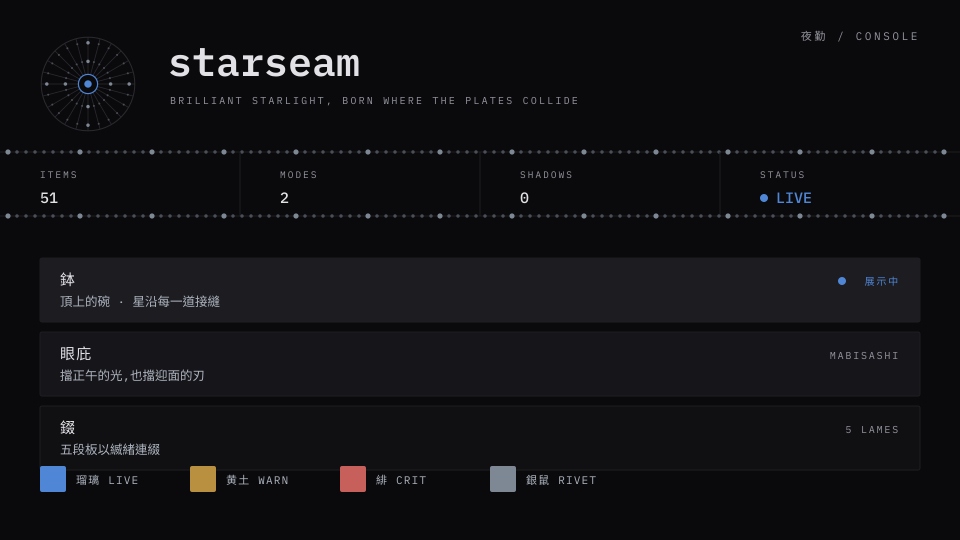
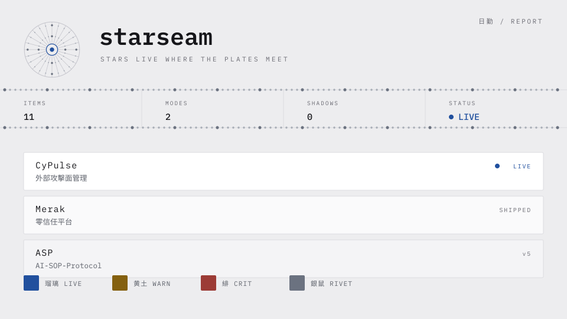

# starseam

> Stars live where the plates meet. — 星,長在甲板相接之處。

日本頭盔有一型叫**星兜**。鉢由數十片鐵板拼成,固定板片的鉚釘刻意不磨平、突出在外——
那些鉚釘的名字就叫「星」。六十二間星兜,六十二片板,上百顆星。

板疊板、以星鉚之,本身就是縱深防禦。

`starseam` 是一套 [shadcn](https://ui.shadcn.com) registry:黒漆為地,鉚釘承重,
繁體中文與日文分語系排版。沒有陰影、沒有毛玻璃、沒有輝光——**深度是實體的**。




> 這兩張規格頁由 `scripts/gen-preview.mjs` 從 token 檔直接產生,
> 文字已轉為外框——所以它們永遠不會顯示系統已經不再出貨的顏色,
> 也不會在缺少中文字型的機器上變成豆腐格。

---

## 安裝

需要 Tailwind CSS v4,以及已初始化的 shadcn 專案。每個元件都會自動帶入 `theme` 這層 token。

```bash
npx shadcn@latest add https://starseam.astroicers.link/r/seam.json
```

或在 `components.json` 註冊命名空間後直接用短名:

```json
{
  "registries": {
    "@starseam": "https://starseam.astroicers.link/r/{name}.json"
  }
}
```

```bash
npx shadcn@latest add @starseam/plate @starseam/stat-band
```

---

## 元件

| Item | 是什麼 |
| --- | --- |
| `theme` | Token 層——黒漆地、鉚釘、嚴重度色、em 網格、分語系字體堆疊 |
| `seam` | **署名元件**。一排鉚釘,標記兩個區塊真正相接之處 |
| `plate` | 基底表面。一片鐵板,無陰影 |
| `lames` | 板片堆疊,一片壓一片(錣) |
| `mark` | 記號。兜的俯視圖 · 星圖 · 雷達幕,三種讀法 |
| `stat-band` | 儀表帶。以接縫線分隔的資料格 |
| `label` / `value` | 儀器排版。等寬、大字距、等寬數字 |
| `status-dot` | 單顆鉚釘代表狀態。只有 critical 會動 |
| `code-tag` | 等寬識別碼——技術棧、版號、CVE |
| `plate-button` | 切出來的板,可以按 |
| `mode-toggle` | 夜勤 ↔ 日勤,附無閃爍的預繪指令碼 |

**表單**

| Item | 是什麼 |
| --- | --- |
| `field` | 串起標籤、控制項、提示與錯誤。錯誤是欄位唯一能上色的地方 |
| `plate-input` / `plate-textarea` | 可以寫進去的板 |
| `plate-checkbox` | 打勾就是**鉚釘釘進去**——鋼銀,不是藍的 |
| `plate-switch` | 滑鈕是沿著接縫滑動的鉚釘 |
| `plate-select` | 浮在最亮那一刀漆上的清單,選取以鉚釘標記 |

**浮層與結構**

| Item | 是什麼 |
| --- | --- |
| `plate-dialog` | 被抬離頁面的一片板,頁首與頁尾的接合處有鉚釘 |
| `plate-sheet` | 自邊緣抽出的面板——靜止原則唯一的方向性例外 |
| `plate-dropdown-menu` | 選單。分隔線是刻痕,不是鉚接的接縫 |
| `plate-tabs` | 分頁列與內容是兩片相接的板,中間走一道鉚縫 |
| `plate-table` | 列即甲板。鉚釘只出現在表頭與表身的接合處 |

---

## 兩種模式,兩種材質

| | |
| --- | --- |
| **console** 夜勤 | 黒漆。顏色是**螢幕發出的光** |
| **report** 日勤 | 紙。顏色是**壓在纖維上的顏料** |

這不是反轉,是同一個顏色的兩種身分。因此主色必須同時是一種光和一種顏料才合格——
瑠璃是群青,磨碎的天青石,兩邊都站得住。

```html
<html data-mode="console">  <!-- 或 report,或省略讓 prefers-color-scheme 決定 -->
```

---

## 選取不是嚴重度

最容易做錯的地方:把「被勾選」「被選中」畫成主色。

在這裡不是。**打勾的方塊是一顆被釘進去的鉚釘**,所以它是銀鼠;分頁被選中是它的鉚釘被釘牢;
下拉選單選中的那一列旁邊出現一顆鉚釘。瑠璃只留給焦點,而任何時刻只有一個東西被聚焦——
這樣藍色才維持得住裁決 02 的稀有度。

錯誤狀態是例外,因為驗證失敗**真的是**一種嚴重度,所以它拿 `--ss-crit`。
而且錯誤永遠同時有文字,顏色從不是唯一線索。

---

## 顏色即嚴重度

在監控室裡,顏色從來不是裝飾。

| Token | 名 | console | report | 意義 |
| --- | --- | --- | --- | --- |
| `--ss-live` | 瑠璃 | `#4F86D6` | `#21509E` | 這個東西活著 |
| `--ss-warn` | 黄土 | `#B9903F` | `#84600F` | 需要注意 |
| `--ss-crit` | 緋 | `#C7605B` | `#9C3B36` | 現在就要處理 |
| `--ss-rivet` | 銀鼠 | `#7E8794` | `#6B7280` | 鉚釘。**金屬,不是藍的** |

色名承載血統,色值為對比度而調——與最接近的日本傳統色的 CIEDE2000 色差:

| Token | 對照 | ΔE00 | |
| --- | --- | --- | --- |
| `live` report `#21509E` | 瑠璃色 `#1E50A2` | **0.5** | 紙上那個值幾乎就是瑠璃色本身 |
| `live` console `#4F86D6` | 瑠璃色 `#1E50A2` | 20.0 | 為發光而大幅提亮 |
| `warn` `#B9903F` | 黄土色 `#C39143` | 3.1 | |
| `crit` report `#9C3B36` | 蘇芳 `#973C3F` | 3.5 | |
| `crit` console `#C7605B` | 緋色 `#D3381C` | 12.3 | 為在黒漆上達 AA 而提亮 |
| `rivet` `#7E8794` | 銀鼠 `#91989F` | 6.5 | |

同一個顏色在兩種模式下與傳統色的距離差這麼多,不是瑕疵——**那正是裁決 05**:
紙上是顏料,螢幕上是光。

**瑠璃必須稀有**——一個畫面至多出現一到兩次。當一個顏色無所不在,它就不再是訊號。

---

## 中日文排版

漢字統一讓中日共用碼位,但字形不同。**骨 直 海 令** 在繁中與日文的印刷體不一樣。
內容是繁中、術語是日文的專案,只用一套字必定有一邊是錯的。

```css
:lang(zh-Hant) { font-family: var(--ss-sans-tc); }
:lang(ja)      { font-family: var(--ss-sans-jp); }
```

字體堆疊以 IBM Plex Sans TC 為首。Google Fonts 目前沒有 Plex Sans TC 的 web 切版
(只有 JP 與 KR),所以 demo 站落到堆疊中的 Noto Sans TC。要用原生 Plex TC 的話:

```bash
npm i @ibm/plex-sans-tc
```

再以 `next/font/local` 掛上——不需要動任何元件,token 早就把它排在第一順位。

---

## 無障礙

目標 WCAG 2.2 AA。所有 token 組合的實測數字、方法與**記錄在案的例外**
在 [`docs/ACCESSIBILITY.md`](./docs/ACCESSIBILITY.md)。

數字不是宣稱的——`scripts/audit-contrast.mjs` 直接讀 token 檔計算,
任何一組低於門檻就讓 CI 失敗。設計系統過不了自己的無障礙聲明,就不該建置。

```bash
node scripts/audit-contrast.mjs
```

---

## Roadmap

v0.1.0 是骨架,刻意只做承重的部分。

**已完成(v0.2.0)**:表單控制項、對話框與 sheet、dropdown menu、tabs、table。
使用者不再需要為了一個輸入框去混用不遵守裁決的原生 shadcn 元件。

**下一步**:tooltip、popover、accordion、toast、breadcrumb、pagination。

**暫緩**:calendar、command palette、carousel、charts。
依賴重、與星兜語彙的槓桿低,有需求再說。

**已知落差**:未經螢幕報讀器實測;未做 200% 縮放與 320px 回流測試。
兩者都列在無障礙文件的「尚未涵蓋」。

---

## 裁決

顏色與元件會改,裁決不會。新元件動工前,先確認它沒有違反 [`DECISIONS.md`](./DECISIONS.md) 任何一條。

最容易違反的三條:

**02 · 瑠璃必須稀有** — 一個畫面至多一到兩次。鉚釘是鋼銀。

**03 · 星只長在接縫上** — 鉚釘出現在兩個區塊**真正相接**的邊界。判準:把星拿掉,
若版面關係不變,那顆星就是假的。

**04 · 深度不靠陰影** — 禁止 `box-shadow` 表達層級、禁止 `backdrop-filter`、禁止輝光。
層級只有兩種合法表達:填色深淺,或實體交疊。

---

## 開發

```bash
npm install
npm run dev            # demo 站
npm run registry:build # 產生 public/r/*.json
npm run typecheck
```

---

## License

MIT © [astroicers](https://github.com/astroicers)
